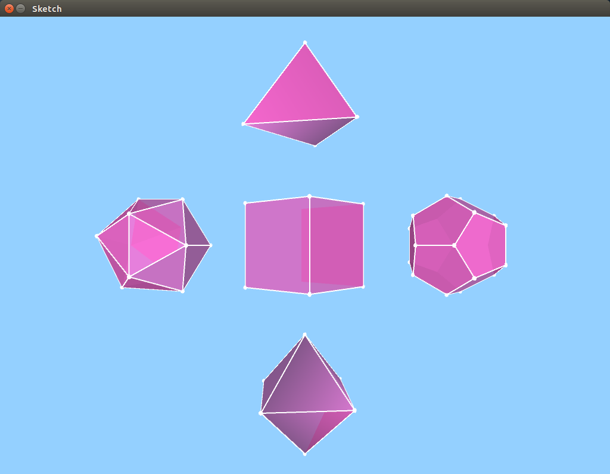

<h1>Sólidos Platónicos en Processing</h1>

En este repositorio encontrarás los códigos en Processing para los cinco <a href="https://es.wikipedia.org/wiki/S%C3%B3lidos_plat%C3%B3nicos">sólidos platónicos</a>.

Esta es una modiicaion del codigo que se encuentra en el siguiente repositorio: <a href="https://github.com/jpcarrascal/ProcessingPlatonicSolids">Link</a>.

<strong>Muestra:</strong>
 

 

<h1>Platonic Solids in Processing</h1>

In this repo you will fine the codes in Processing for the five <a href="https://en.wikipedia.org/wiki/Platonic_solid">platonic solids</a>.

This is a modification of the code found in the following repo: <a href="https://github.com/jpcarrascal/ProcessingPlatonicSolids">Link</a>.

<strong>Sample:</strong>
 
